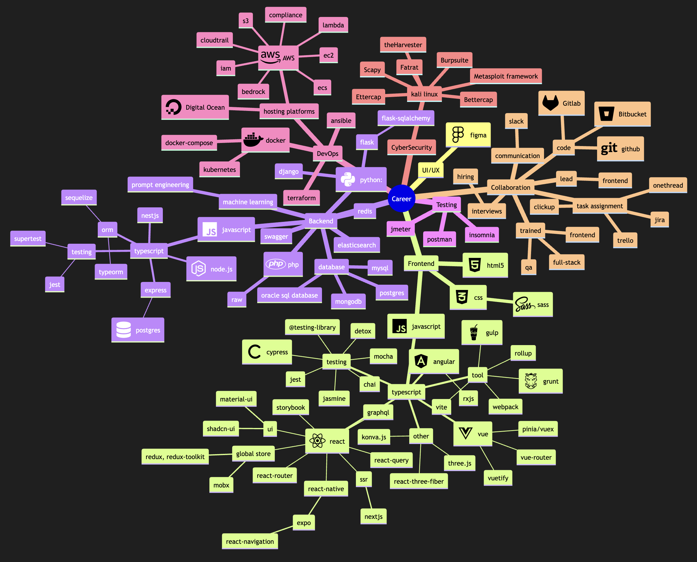

### Hi there, I'm Shabuktagin Photon Khan -aka [Photon][website] 👋

## I'm a Senior Software Engineer (Full Stack Engineer)

- 🔭 &nbsp;Working on
  - **React**, **Nextjs**
  - **React Native**
  - **Vue**, **Angular**
  - **Django**, **Flask**
  - **Express**, **Nestjs**
  - **Langchain**, **ML Models**
- 🥅 &nbsp;Explored: **Go**, **Rust**, **Ethical Hacking**
- 🥅 &nbsp;Management: **Advice**, **Train**, **Interview**
- 🌱 &nbsp;Learning **AWS**, **Terraform**, **Ansible**, **.ASP**
- ⚡ &nbsp;Fun fact: **Play Guitar**, **Fly Drones**, **Video Editing**

---

### [🌐 &nbsp; Connect with me ][website]

[][blog]
[][linkedin]
[][medium]

[][hackerrank]
[][codeacademy]
[][leetcode]

[][codewar]  

 

  

### Languages and Tools:

---

[][website]
[][website]
[][website]
[][website]
[][website]
[][website]
[][website]
 

---

[][website]
[][website]
[][website]
[][website]
[][website]
[][website]
[][website]
[][website]
[][website]

[][website]
[][website]

 

---

 

---

[][website]
[][website]
[][website]
[][website]
[][website]

[][website]
[][website]
[][website]

 

---

[][website]
[][website]
 

---

[][website]
[][website]

 

---

[][website]
[][website]
[][website]
[][website]

[][website]
[][website]

[][website]
[][website]
[][website]

[][website]
[][website]
 

[][website]
[][website]
[][website]

 

---

[][website]

[][website]
[][website]
[][website]

[][website]

 

---

[][website]

 

---

[][website]

 

---

[][website]
[][website]
[][website]
 

---

 

---

[][website]

[][website]

---

https://github.com/mp5maker/mp5maker/assets/10275597/74d697bd-fc9c-4e72-b7a9-ea82d1334eb1

---

[website]: https://react-pixie.vercel.app/
[gitlab]: https://gitlab.com/khan.photon
[linkedin]: https://www.linkedin.com/in/shabuktaginkhan/
[blog]: https://photons-blog.netlify.app/
[hackerrank]: https://www.hackerrank.com/photonkhan
[codewar]: https://www.codewars.com/users/mp5maker
[codeacademy]: https://www.codecademy.com/profiles/mp5maker
[medium]: https://khan-photon.medium.com/
[leetcode]: https://leetcode.com/user8791Zv/
