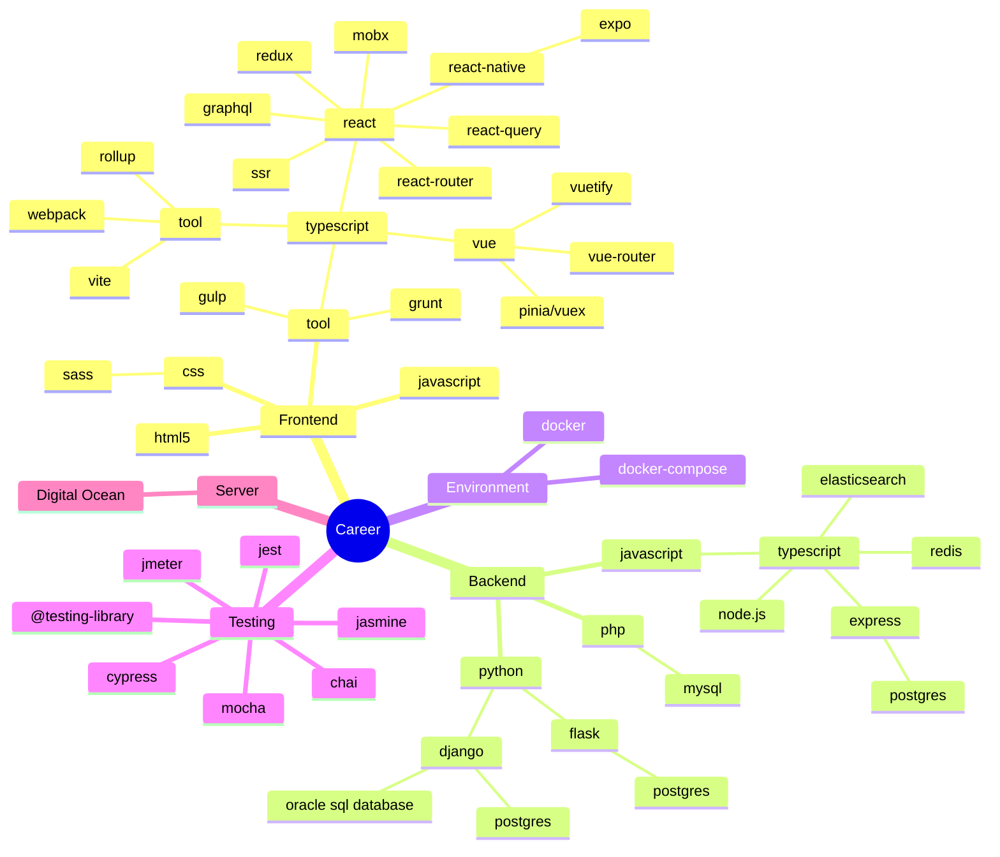

```mermaid
mindmap
root((Career))
  Frontend
    html5
    ::icon(fa-brands fa-html5)
    css
    ::icon(fa-brands fa-css3-alt)
      sass
      ::icon(fa-brands fa-sass)
    javascript
    ::icon(fa-brands fa-js)
    tool
      gulp
      grunt
      typescript
        tool
          webpack
          rollup
          vite
        react
        ::icon(fa-brands fa-react)
          redux
          mobx
          react-router
          react-query
          react-native
            expo
          ssr
          graphql
        vue
        ::icon(fa-brands fa-vuejs)
          pinia/vuex
          vue-router
          vuetify

  Backend
    javascript
    ::icon(fa-brands fa-js)
      typescript
        node.js
        ::icon(fa-brands fa-node-js)
        express
          postgres
          ::icon(fa-solid fa-database)
        redis
        elasticsearch
    python
    ::icon(fa-brands fa-python)
      flask
          postgres
          ::icon(fa-solid fa-database)
      django
          postgres
          ::icon(fa-solid fa-database)
          oracle sql database
          ::icon(fa-solid fa-database)
    php
    ::icon(fa-brands fa-php)
      mysql
      ::icon(fa-solid fa-database)

  Environment
    docker
    docker-compose

  Testing
    jasmine
    chai
    mocha
    jest
    @testing-library
    cypress
    jmeter

  Server
    Digital Ocean
```
