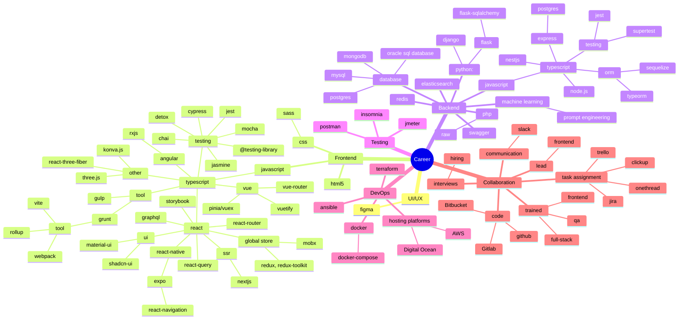

```mermaid
mindmap
root((Career))
  UI/UX
    figma
    ::icon(fa-brands fa-figma)
  Frontend
    html5
    ::icon(fa-brands fa-html5)
    css
    ::icon(fa-brands fa-css3-alt)
      sass
      ::icon(fa-brands fa-sass)
    javascript
    ::icon(fa-brands fa-js)
      typescript
        react
        ::icon(fa-brands fa-react)
          global store
            redux, redux-toolkit
            mobx
          react-router
          react-query
          ssr
            nextjs
          ui
            material-ui
            shadcn-ui
          graphql
          react-native
            expo
              react-navigation
          storybook
        vue
        ::icon(fa-brands fa-vuejs)
          pinia/vuex
          vue-router
          vuetify
        angular
        ::icon(fa-brands fa-angular)
          rxjs
        tool
          gulp
          ::icon(fa-brands fa-gulp)
          grunt
            ::icon(fa-brands fa-grunt)
            tool
              webpack
              rollup
              vite
        testing
          jasmine
          chai
          mocha
          jest
          @testing-library
          cypress
          detox
        other
          konva.js
          react-three-fiber
          three.js

  Backend
    javascript
    ::icon(fa-brands fa-js)
      typescript
        node.js
        ::icon(fa-brands fa-node-js)
        express
          postgres
          ::icon(fa-solid fa-database)
        nestjs
        orm
          sequelize
          typeorm
        testing
          supertest
          jest
    python:
      ::icon(fa-brands fa-python)
      flask
        flask-sqlalchemy
      django
    php
    ::icon(fa-brands fa-php)
      raw
    database
      postgres
      oracle sql database
      mysql
      mongodb
    redis
    elasticsearch
    swagger
    machine learning
      prompt engineering

  Testing
    postman
    insomnia
    jmeter

  DevOps
    terraform
    ansible
    docker
    ::icon(fa-brands fa-docker)
      docker-compose
      ::icon(fa-brands fa-docker)
    hosting platforms
      Digital Ocean
      ::icon(fa-brands fa-digital-ocean)
      AWS
      ::icon(fa-brands fa-aws)

  Collaboration
    interviews
      hiring
    lead
      frontend
    trained
      frontend
      qa
      full-stack
    task assignment
      jira
      clickup
      trello
      onethread
    communication
      slack
    code
      github
      ::icon(fa-brands fa-git)
      Gitlab
      ::icon(fa-brands fa-gitlab)
      Bitbucket
      ::icon(fa-brands fa-bitbucket)
```
