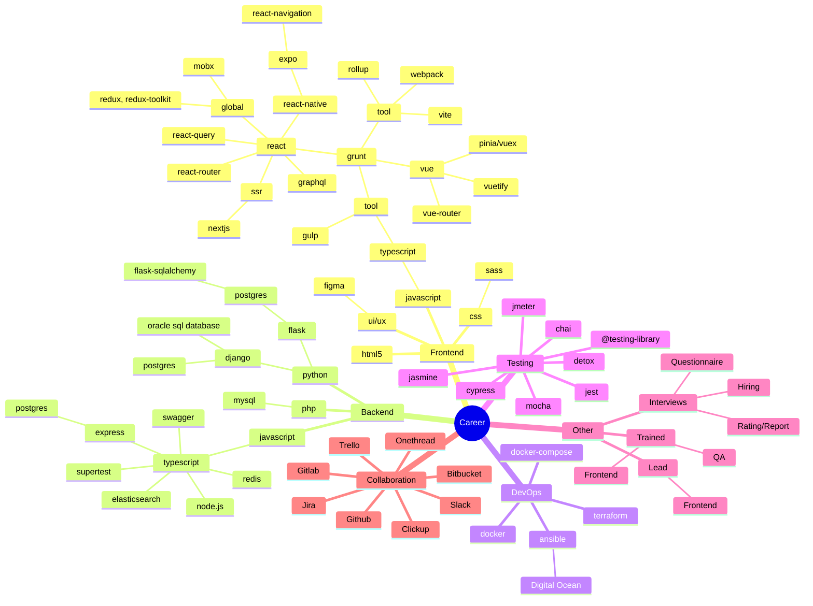

```mermaid
mindmap
root((Career))
  Frontend
    ui/ux
      figma
      ::icon(fa-brands fa-figma)
    html5
    ::icon(fa-brands fa-html5)
    css
    ::icon(fa-brands fa-css3-alt)
      sass
      ::icon(fa-brands fa-sass)
    javascript
    ::icon(fa-brands fa-js)
      typescript
        tool
          gulp
          ::icon(fa-brands fa-gulp)
          grunt
            ::icon(fa-brands fa-grunt)
            tool
              webpack
              rollup
              vite
            react
            ::icon(fa-brands fa-react)
              global
                redux, redux-toolkit
                mobx
              react-router
              react-query
              ssr
                nextjs
              graphql
              react-native
                expo
                  react-navigation
            vue
            ::icon(fa-brands fa-vuejs)
              pinia/vuex
              vue-router
              vuetify

  Backend
    javascript
    ::icon(fa-brands fa-js)
      typescript
        node.js
        ::icon(fa-brands fa-node-js)
        express
          postgres
          ::icon(fa-solid fa-database)
        redis
        elasticsearch
        swagger
        supertest
    python
    ::icon(fa-brands fa-python)
      flask
          postgres
          ::icon(fa-solid fa-database)
            flask-sqlalchemy
      django
          postgres
          ::icon(fa-solid fa-database)
          oracle sql database
          ::icon(fa-solid fa-database)
    php
    ::icon(fa-brands fa-php)
      mysql
      ::icon(fa-solid fa-database)

  DevOps
    docker
    ::icon(fa-brands fa-docker)
    docker-compose
    ::icon(fa-brands fa-docker)
    terraform
    ansible
      Digital Ocean
      ::icon(fa-brands fa-digital-ocean)

  Testing
    jasmine
    chai
    mocha
    jest
    @testing-library
    cypress
    jmeter
    detox

  Other
    Interviews
      Hiring
      Rating/Report
      Questionnaire
    Lead
      Frontend
    Trained
      Frontend
      QA

  Collaboration
    Clickup
    Jira
    Slack
    Onethread
    Trello
    Github
    ::icon(fa-brands fa-git)
    Gitlab
    Bitbucket
```
