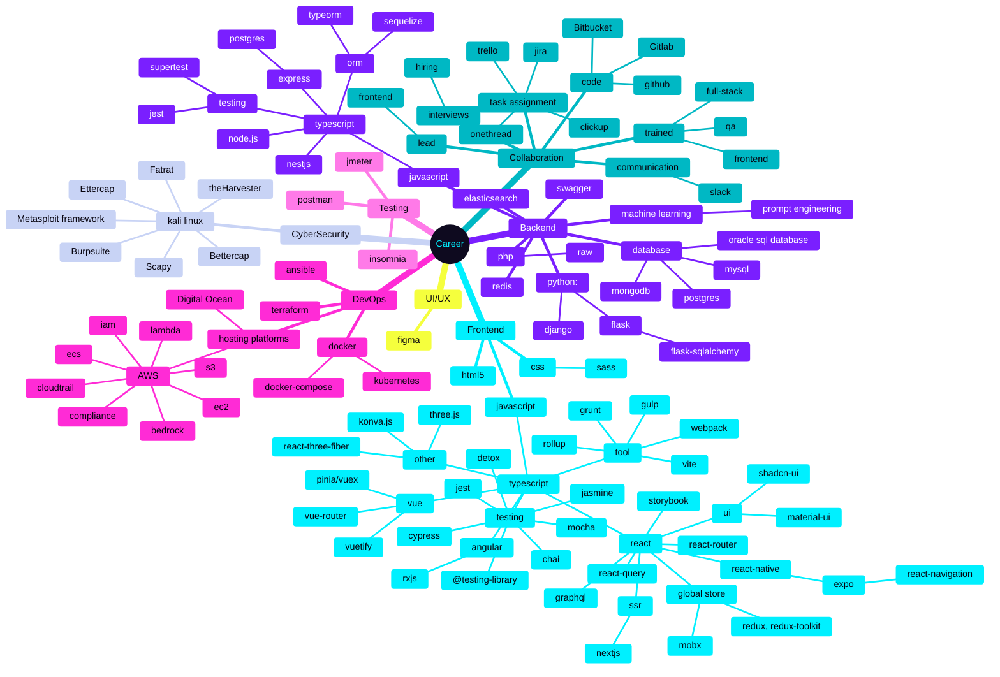

```mermaid
%%{init: {
  "theme": "base",
  "themeVariables": {
    "darkMode": true,
    "background": "#07040F",
    "fontFamily": "Menlo, Courier New, monospace",
    "lineColor": "#241A45",
    "git0": "#0E0A1F",
    "gitBranchLabel0": "#00F0FF",
    "cScale0": "#0E0A1F",
    "cScale1": "#F5FF3D",
    "cScale2": "#00F0FF",
    "cScale3": "#7A1FFF",
    "cScale4": "#FF7AE8",
    "cScale5": "#FF2BD6",
    "cScale6": "#C8D3F5",
    "cScale7": "#00B8C4",
    "cScale8": "#F5FF3D",
    "cScale9": "#00F0FF",
    "cScale10": "#7A1FFF",
    "cScale11": "#FF2BD6",
    "cScaleLabel0": "#00F0FF",
    "cScaleLabel1": "#07040F",
    "cScaleLabel2": "#07040F",
    "cScaleLabel3": "#FFFFFF",
    "cScaleLabel4": "#07040F",
    "cScaleLabel5": "#07040F",
    "cScaleLabel6": "#07040F",
    "cScaleLabel7": "#07040F",
    "cScaleLabel8": "#07040F",
    "cScaleLabel9": "#07040F",
    "cScaleLabel10": "#FFFFFF",
    "cScaleLabel11": "#07040F",
    "cScaleInv0": "#00F0FF",
    "cScaleInv1": "#07040F",
    "cScaleInv2": "#07040F",
    "cScaleInv3": "#07040F",
    "cScaleInv4": "#07040F",
    "cScaleInv5": "#07040F",
    "cScaleInv6": "#07040F",
    "cScaleInv7": "#07040F",
    "cScaleInv8": "#07040F",
    "cScaleInv9": "#07040F",
    "cScaleInv10": "#07040F",
    "cScaleInv11": "#07040F"
  },
  "themeCSS": ".section-root circle, .section--1 circle { stroke: #00F0FF; stroke-width: 4px; }"
}}%%
mindmap
root((Career))
  UI/UX
    figma
    ::icon(fa-brands fa-figma)
  Frontend
    html5
    ::icon(fa-brands fa-html5)
    css
    ::icon(fa-brands fa-css3-alt)
      sass
      ::icon(fa-brands fa-sass)
    javascript
    ::icon(fa-brands fa-js)
      typescript
        react
        ::icon(fa-brands fa-react)
          global store
            redux, redux-toolkit
            mobx
          react-router
          react-query
          ssr
            nextjs
          ui
            material-ui
            shadcn-ui
          graphql
          react-native
            expo
              react-navigation
          storybook
        vue
        ::icon(fa-brands fa-vuejs)
          pinia/vuex
          vue-router
          vuetify
        angular
        ::icon(fa-brands fa-angular)
          rxjs
        tool
          gulp
          ::icon(fa-brands fa-gulp)
          grunt
            ::icon(fa-brands fa-grunt)
          webpack
          rollup
          vite
        testing
          jasmine
          chai
          mocha
          jest
          @testing-library
          cypress
          ::icon(fa-brands fa-c)
          detox
        other
          konva.js
          react-three-fiber
          three.js

  Backend
    javascript
    ::icon(fa-brands fa-js)
      typescript
        node.js
        ::icon(fa-brands fa-node-js)
        express
          postgres
          ::icon(fa-solid fa-database)
        nestjs
        orm
          sequelize
          typeorm
        testing
          supertest
          jest
    python:
      ::icon(fa-brands fa-python)
      flask
        flask-sqlalchemy
      django
    php
    ::icon(fa-brands fa-php)
      raw
    database
      postgres
      oracle sql database
      mysql
      mongodb
    redis
    elasticsearch
    swagger
    machine learning
      prompt engineering

  Testing
    postman
    insomnia
    jmeter

  DevOps
    terraform
    ansible
    docker
    ::icon(fa-brands fa-docker)
      docker-compose
      kubernetes
    hosting platforms
      Digital Ocean
      ::icon(fa-brands fa-digital-ocean)
      AWS
      ::icon(fa-brands fa-aws)
        ec2
        lambda
        iam
        ecs
        s3
        cloudtrail
        compliance
        bedrock

  CyberSecurity
    kali linux
      theHarvester
      Metasploit framework
      Fatrat
      Burpsuite
      Scapy
      Bettercap
      Ettercap

  Collaboration
    interviews
      hiring
    lead
      frontend
    trained
      frontend
      qa
      full-stack
    task assignment
      jira
      clickup
      trello
      onethread
    communication
      slack
    code
      github
      ::icon(fa-brands fa-git)
      Gitlab
      ::icon(fa-brands fa-gitlab)
      Bitbucket
      ::icon(fa-brands fa-bitbucket)
```
